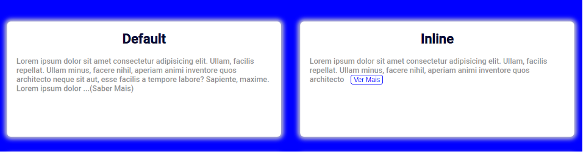
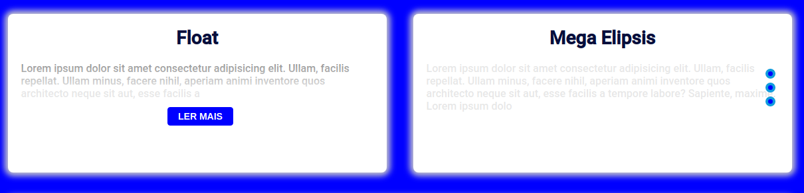
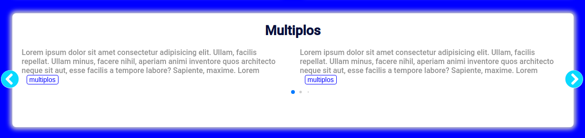

<h1 align="center">SeeMore.js (beta)</h1>

  
  
  
    
  

# :space_invader: Sobre o projeto :space_invader:

`SeeMore.JS` é uma lib js desenvolvida no intuito de ajudar desenvolvedores a criarem toasts do tipo 'see more' and 'know more'  de forma rápida, pŕatica e customizada.
---

### [Visualizar projeto publicado](https://akistapace.github.io/see-more.js/):  

---
   ### Tipos  
   

        
   

   

        
   

   

        
   

---
##  :star: Autor :star:

 ## <b>Fernando Aquistapace</b></a> 
---

